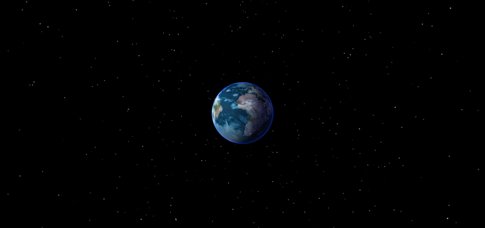

# Rotating-earth-on-starry-sky
A rotating earth on a starry sky made using 3js.

You can zoom in, zoom out and use cursor to see it from different angles.

The earth have both night and day on left and right side and it is constantly rotating.

